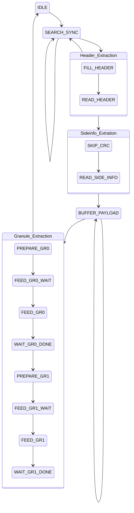

# Frame Parser
This module was fully developed and implemented by us, it was not part of the MP3 IP.
### Overview
The standart MP3 (MPEG v1, Layer III) is composed of frames. Each frame incorporates metadata in the form of header- and sideinfo-bytes as well as the audio data split into two granules, zero and one. The IP core from [TODO] proviedes struts for all the metadata, they can be found inside file [TODO] [file all_types.vhd], but no logic to correctly extract it. This requires the implementation of an MP3 frame parser. Since the MP3 core used in this project is only a very slimple implementation, it only supports the very rare Mono Channel MP3 files. Today, most modern mono MP3 files use Joint Stereo mode, therefore thy will not work with this IP. We provided some example files [TODO] [files testfile.mp3] for testing.
### Concept
The frame parser is required to do two important tasks, extracting the frame metadata and the granule data. This needs to happen in two steps, becuase the location and lenth of the granules is calculated from the header and sideinfo. Since the granules start can be located before the frame header it is important to record all input data, the spec recommends a circular buffer for this. The extracted granules are then fed individually into the MP3 decoding logic alsongside the corresponding metadata. 

## Implementation
## IO
### In 
- <b>clk</b>   The clock
- <b>rst</b>   A reset signal
- <b>datIN</b>    8 Bit Signal. Data input bytes.
- <b>enable </b>   Signal. If high, datIN is valid this cycle.
- <b>huff_done </b>   Signal. If high, Huffman module is done.

### Out
- <b>req_data</b>  Signal. Frame Parser is ready to accept data.
- <b>datOUT</b>  8 Bit Signal. Extracted payload data bytes.
- <b>addr</b>  10 Bit Signal. Address signal for data request from Huffman IP.
- <b>huff_start</b>  Signal. Enable for Huffman module.
- <b>huff_gr</b>  Signal. Granule index 0/1 for Huffman module.
- <b>frm</b>  Frame info struct. Struct with all metadata values.

### Main State machine:

- <b>SEARCH_SYNC</b>   In this state all incoming mp3 bytes are shifted into a 32b register `shift_reg` to search for the 11bit start of frame marker. This state will loop until a marker is found. Bytes that is not part of a frame can safely be discarded.
- <b>Header_Extraction</b>   Fills the  shift register with all 4 header bytes and extracts frame header values. With these values, the length of the payload data `payload_size` can be calculated. When the values do not match the required MP3 format, the header is rejected and the state machine returns to `SEARCH_SYNC`.
- <b>Sideinfo_Extration</b>   This state reads the input data inside a 17 byte shift register `bits_tmp` to extract the frame side information. 
- <b>BUFFER_PAYLOAD</b>   This state stores the number of payload data bytes calculated in `READ_HEADER` inside a ring buffer. It is necessary to keep the payload belonging to old frames since it can be part of the payload of the current frame. When `payload_size` bytes are received the entire payload is inside the ringbuffer.
- <b>Granule_Extraction</b>   In this granule extraction state both granules are transmitted alongside their corresponding frame data. This metadata is written to the global struct `frm` inside the `PREPARE_GRn` states. In the following `FEED_GRn` states, the granules are being transmitted to the Huffman IP. Each of these granules is then processed by the entire MP3 decoder pipeline and becomes a small audio sample. To find the exact location of the first payload bit, the read pointer `rd_ptr` is calculated. The Huffman IP expects to receive a fixed set of 1024 bytes of which the first bit is the start of granule 0. Granule 1 is expected to start in the bit after granule 0, the rest of the bits are disregarded (<em>We assume this is a simplification measure, since in a more efficient IP core the Huffman decoder would read directly from the ring buffer. However its logic is very prone for errors, thus the original developers likely avoided it altogether and left its implementation to the user.</em>). The `WAIT_GRn_DONE` states finally wait for the Huffman decoder to finish before returning to `SEARCH_SYNC` (<em>Technically it would be possible to improve performance by extracting the next frame while the pipeline is processing. We decided against it, mainly for complexity reasons but also because the processing speed is drastically higher than the audio playback rate either way.</em>). 

## Functionality:
The main process here controlls the state machine (<em>SM</em>) and the bit extraction logic, as described above. Since the <em>SM</em> is run by a clocked process and some variables like `bit_idx` and `calc_size` are used throughout the states, this implementation definitly is not the most efficient possible. We want to make sure this was a deliberate decision, sacrificing performance for gains especially in the form of readability. Since in bit extraction logics like these, even the slightes error can cause a complete fallout, keeping code readable was more important to us. There was one optimization however we deceided to go for, which is the avoidance of the division when calculating the frame size `calc_size := (144 * br_val) / sr_val`. Since both bitrate `br_val`and samplerate `sr_val` only allow for discrete values this was replacef with a look-up-table `FRAME_SIZE_LUT` to avoid costly hardware division.
A second process `proc_flow_control` is used to control the input flow of data. It is reacting upon state transitions and blocks the memory controller when the <em>SM</em> is busy.
