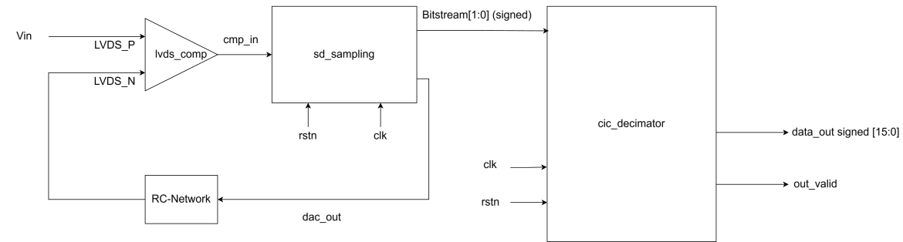
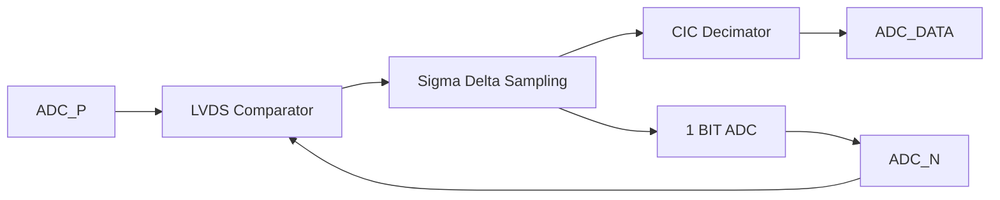
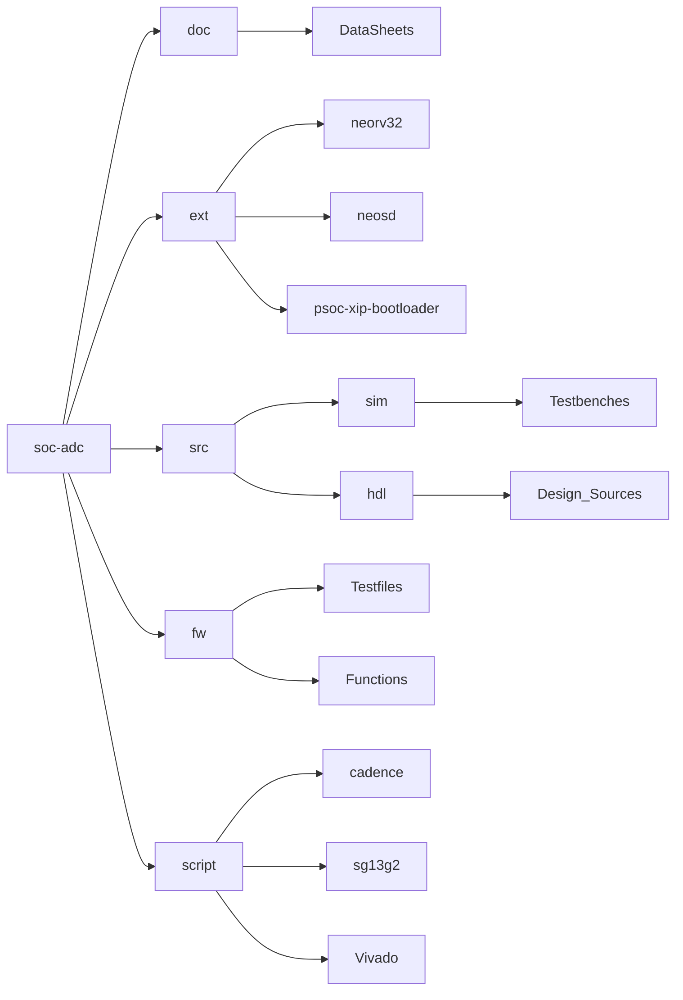
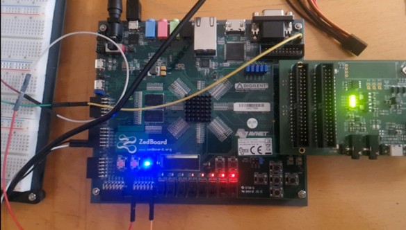
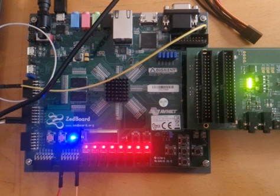

# First-Order Sigma-Delta ADC on Zedboard Zynq-7000 SoC

## 1. Project Overview

Welcome to the PSoC ADC Project of Group 5!

Follow this link to go to our Wiki-Documentation of this project:
https://gitlab.itiv.kit.edu/psoc/ws25-26/group5/soc-adc/-/wikis/soc_adc

This project implements a **first-order Sigma–Delta Analog-to-Digital Converter (ADC)** on the ZedBoard, based on the Zynq-7000 All-Programmable SoC.
The system combines analog front-end circuitry with digital signal processing implemented in FPGA programmable logic. The modulator generates a 1-bit oversampled bitstream, which is digitally filtered and decimated to produce a multi-bit digital output signal.
The project demonstrates the practical implementation of oversampling ADC concepts on a modern SoC platform.

---

## 2. System Architecture
The first-order Sigma–Delta modulator consists of:
- 1-bit quantizer (lvds_comp)
- Sigma-Delta Sampling Element (sd_sampling)
- 1-bit feedback DAC (dac_out)
- Low-Pass Filter (RC-Network)
- Digital decimation filter (cic_decimator)

### Block Diagram
 

**Legends:**
- `ADC_P`: V_in analog data
- `ADC_N`: V_out feedback data
- `LVDS Comparator`: converts differential LVDS input pair into a single-ended signal
- `Sigma Delta Sampling`: digital sampling stage 
- `CIC Decimator`: converts high-frequency 1-bit bitstream into a low-frequency multi-bit digital output
- `1 BIT ADC`: feedback signed and unsigned

 ---

## 3. Project Structure

---

## 4. Hardware Setup

- Development Board: Zedboard Zynq-7000
- Extension Board
- HS2 JTAG debugger

---

## 5. FPGA / SoC Implementation
The programmable logic implements:
- Bitstream acquisition
- Clock generation
- Digital low-pass filtering
- Decimation
- Data output interface

---

## 6. Build and Usage

### Requirements
- Vivado (recommended version: 2024.1)

### Steps
1. Download the Project from the main Branch
2. Open the Vivado project via psoc.tcl
3. Generate Bitstream
4. Connect Zedboard with PC 
5. Under 'Open Hardware Manager' Open Target
6. Program Device
 

---

## 7. Results and Performance

During the hardware simulation, the decimated ADC output was visualized using an LED bar display. This provided a simple and intuitive representation of the converted digital signal amplitude.

An external control circuit was used to adjust the input voltage, allowing us to emulate a variable analog signal. By manually varying the voltage level, different operating points of the Sigma–Delta ADC could be evaluated and observed in real time.

Due to the high sensitivity of the LVDS comparator used as the 1-bit quantizer, the effective operating range of the system is relatively limited. Small variations in the input voltage can already lead to significant changes in the output bitstream, which restricts the usable input amplitude range without additional signal conditioning.

---

## 8. Contact Informations

- **Authors:** Ruijue Luo, Julian Dorner, Immanuel Kral
- **Course:** Laboratory System on Chip
- **University:** Karlsruher Institut fuer Technologie
- **Year:** 2025/26
